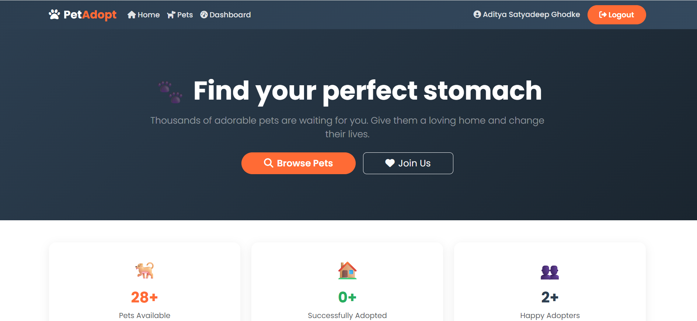
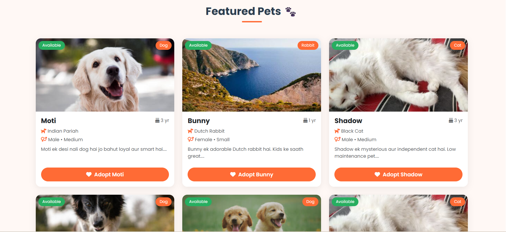
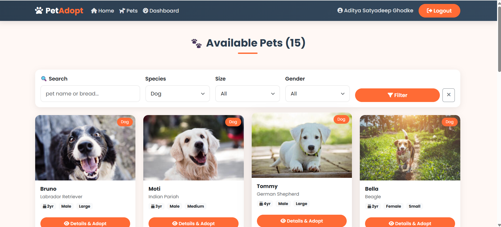
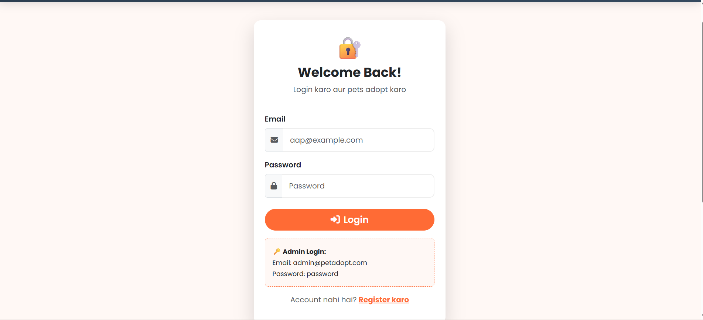
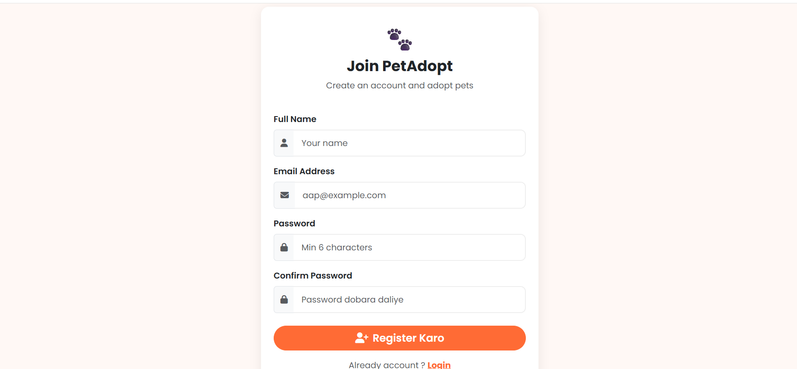
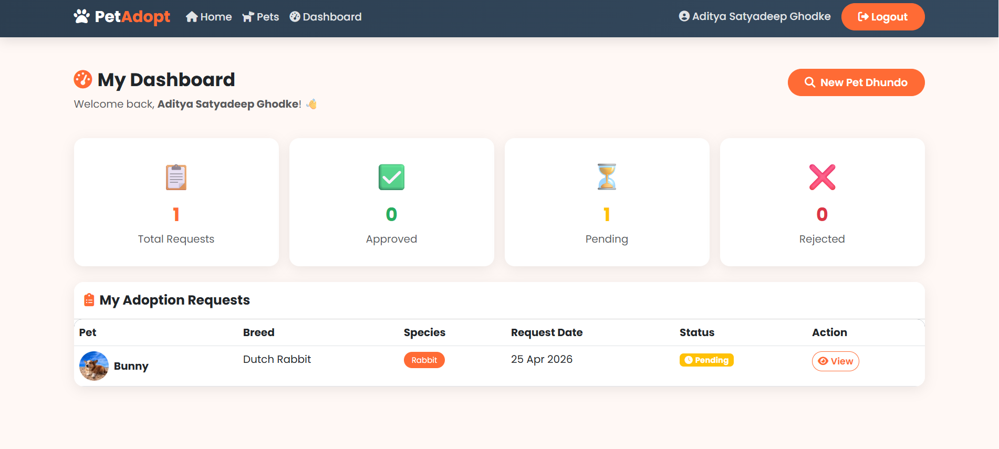
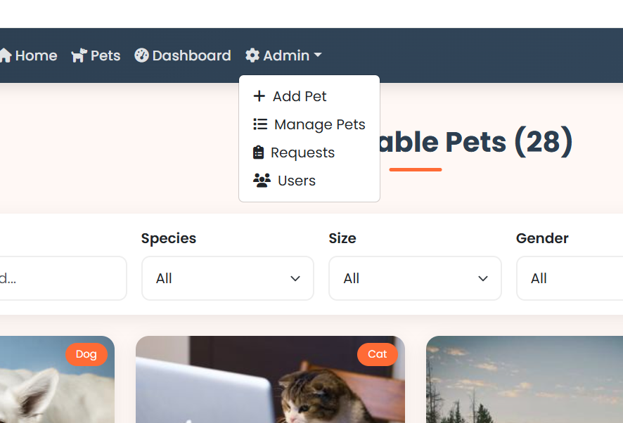

# 🐾 PetAdopt India - Pet Adoption Website

A full-featured pet adoption web application built with PHP MySQL and Apache on AWS EC2.

## 🌐 Live Demo
http://13.126.251.220/pet-adoption/

## 🌟 Features
- Browse 15+ pets - Dogs Cats Birds Rabbits
- Filter by species size gender
- User registration and login
- Send adoption requests
- Admin panel - manage pets and requests
- Mobile friendly Bootstrap 5 design
- Pet photo upload
- Secure password hashing

## 🛠️ Tech Stack
| Technology | Details |
|-----------|---------|
| Backend | PHP 8.3 |
| Database | MySQL 8.0 |
| Web Server | Apache 2.4 |
| Frontend | Bootstrap 5.3 |
| Cloud | AWS EC2 Ubuntu 24.04 |

## 📸 Screenshots

### 🏠 Homepage


### 🐾 Pets Page


### 🔐 Login Page


### 📝 Register Page


### ⚙️ Admin Dashboard


### 🐕 Manage Pets


### 📋 Manage Requests


## 📁 Project Structure
pet-adoption/
├── config.php          - Database connection
├── header.php          - Navbar and styles
├── footer.php          - Footer
├── index.php           - Homepage
├── pets.php            - All pets with filters
├── pet_detail.php      - Pet detail and adopt
├── register.php        - User register
├── login.php           - User login
├── dashboard.php       - User dashboard
├── logout.php          - Logout
├── database.sql        - Database file
├── uploads/            - Pet photos
└── admin/
├── dashboard.php       - Admin home
├── add_pet.php         - Add pet
├── edit_pet.php        - Edit pet
├── manage_pets.php     - All pets
├── manage_requests.php - Requests
└── manage_users.php    - Users

## 🗄️ Database
| Table | Description |
|-------|-------------|
| users | User accounts |
| pets | Pet listings |
| adoption_requests | Adoption requests |

## 🚀 Installation on AWS EC2

### 1. Launch EC2
- Ubuntu 24.04 LTS
- t2.micro Free tier
- Security Group - HTTP 80 and SSH 22

### 2. Install LAMP
```bash
sudo apt update
sudo apt install apache2 mysql-server php libapache2-mod-php php-mysql php-gd -y
```

### 3. Clone Project
```bash
cd /var/www/html
sudo git clone https://github.com/AdityaGhodk/pet-adoption-php.git pet-adoption
sudo chmod -R 755 pet-adoption
sudo chmod -R 777 pet-adoption/uploads
```

### 4. Setup Database
```bash
sudo mysql < /var/www/html/pet-adoption/database.sql
sudo systemctl restart apache2
```

### 5. Open Browser
http://13.126.251.220/pet-adoption/

## 📸 Screenshots

### 🏠 Homepage


### 🐾 Pets Page


### 🔐 Login Page


### 📝 Register Page


### ⚙️ Admin Dashboard


### 🐕 Manage Pets


### 📋 Manage Requests

